# README v2 — Proposal (DO NOT APPLY YET)

> **Status:** draft proposal for review. This file is the proposal wrapper;
> the deployable draft starts after the `PROPOSED README BEGINS` marker.
> **To apply:** delete everything above the marker (and the marker itself),
> fill the `docs/assets/` slots (capture instructions below), then replace
> `README.md` in a reviewed PR. `README.md` is intentionally untouched by this change.

## What changes vs current README (102 lines)

1. **Badges:** keep `dbt build` + `deploy dashboard`; add daily-refresh badge
   (links to the live `/status` trust page) and MIT license badge.
2. **Visuals:** add screenshot slots (Overview, Forecast planner, Market/Margin)
   + a 15–30s demo GIF slot. All point at `docs/assets/` with capture instructions below.
3. **Architecture:** replace the ASCII diagram with a GitHub-rendered **Mermaid**
   flowchart (spec included; no new tooling — `mermaid` fences render natively).
4. **Numbers:** `PASS=61` → `PASS=92 WARN=0 ERROR=0` (verified in CI;
   see `PROJECT_STATUS.md` §7), feature table updated (margin mart, forecast,
   semantic layer, `/status` page).
5. **New sections:** Decision table (why DuckDB / DuckLake / ASOF / contracts /
   Evidence), Data freshness (last-refresh story via `/status` + `status.json`),
   Roadmap, and links to the case study + contributing guide.
6. Nothing is removed that a returning user needs: Quickstart and Stack stay,
   updated for the semantic-layer compile step.

## Screenshot / GIF capture instructions

Prereqs: `cp palm.duckdb dashboard/sources/palm/palm.duckdb && cd dashboard && npm install && npm run dev` → `http://localhost:3000`.

| Slot | File | How to capture |
|---|---|---|
| Overview page | `docs/assets/screenshot-overview.png` | Viewport **1440×900**, light mode, scroll to top, hide bookmarks bar. Windows: <kbd>Win</kbd>+<kbd>Shift</kbd>+<kbd>S</kbd> or browser full-page screenshot (DevTools → `Capture full size screenshot`). |
| Forecast planner | `docs/assets/screenshot-forecast.png` | `/forecast` page, a region with mixed favorable/unfavorable days visible. Same viewport. |
| Market / margin | `docs/assets/screenshot-market.png` | `/market` or `/margin` chart mid-scroll. |
| Demo GIF | `docs/assets/demo.gif` | **ScreenToGif** (free) or LICEcap: 800px wide, ~15fps, **15–30s, <10MB**. Script: load Overview → switch region → open Forecast → open Status page. Narration optional; see `demo-script.md`. |

After capturing, replace the `<!-- SLOT: … -->` placeholder lines in the draft
with ``. Until then the placeholders render as text —
the README still reads fine without the images.

## Verification checklist (before merging the replacement)

- [ ] `docs/assets/` images exist at the referenced paths (no broken icons).
- [ ] Mermaid renders on github.com (preview the branch view).
- [ ] Every badge links somewhere live; `/status` and `status.json` URLs return 200.
- [ ] PASS count matches the latest green `dbt.yml` run.
- [ ] Relative links (`docs/portfolio/case-study.md`, `CONTRIBUTING.md`, `LICENSE`) resolve.

---
--- PROPOSED README BEGINS BELOW — everything above is wrapper ---

---

# 🌴 palm-analytics-dbt

[](https://github.com/itw-code/palm-analytics-dbt/actions/workflows/dbt.yml)
[](https://github.com/itw-code/palm-analytics-dbt/actions/workflows/pages.yml)
[](https://itw-code.github.io/palm-analytics-dbt/status)
[](LICENSE)

End-to-end **analytics engineering** on a real domain: Indonesian palm-oil estate
operations. Four free public data sources → DuckLake + DuckDB → dbt (staging →
intermediate → marts) → an interactive Evidence.dev dashboard — reproducibly,
tested, and refreshed daily by CI.

**🔗 Live dashboard:** https://itw-code.github.io/palm-analytics-dbt/
**📡 Freshness & trust page:** https://itw-code.github.io/palm-analytics-dbt/status
· machine-readable: [status.json](https://itw-code.github.io/palm-analytics-dbt/status.json)

<!-- SLOT: demo GIF — replace this line with  (see capture instructions in docs/portfolio/README-v2-PROPOSAL.md) -->
<!-- SLOT: screenshots — replace with docs/assets/screenshot-overview.png, screenshot-forecast.png, screenshot-market.png -->

## The question it answers

*Given today's weather and the palm-oil price (in local currency), which estate
operations — fertilize, harvest, spray — are favorable in each region, and what
is a good harvest day worth?* An **effective harvest day** also requires
available labour (not a weekend or Indonesian public holiday).

## Architecture

```mermaid
flowchart LR
    subgraph Sources [Free public sources — keyless]
        W[Open-Meteo<br/>weather + 7-day forecast]
        F[Frankfurter ECB<br/>USD→IDR rate]
        H[Nager.Date<br/>ID holidays]
        C[World Bank Pink Sheet<br/>palm/soy prices]
    end
    Sources -->|load_raw.py<br/>retry + synthetic fallback| Lake[(DuckLake catalog<br/>parquet + ACID snapshots)]
    Lake -->|dbt build| STG[staging<br/>stg_* views]
    STG --> INT[intermediate<br/>calendar spine · ASOF FX/price fill<br/>agronomy signals macro]
    INT --> MARTS[marts<br/>dim_date · dim_region<br/>fct_operations · fct_forecast_7day<br/>fct_margin · fct_price + SCD2 snapshot<br/>contract · sl_metrics_daily]
    MARTS --> WH[(palm.duckdb<br/>marts only)]
    WH --> EV[Evidence.dev<br/>Overview · Forecast · Market · Margin · Status]
    EV -->|GitHub Pages| LIVE([Live dashboard])
    CI[GitHub Actions<br/>daily 00:00 UTC cron] -.->|ingest → build → freshness → deploy| LIVE
```



Raw API payloads land in a **DuckLake** catalog (`palm_lake/`): open parquet
files with ACID snapshot metadata — one snapshot per daily load, recorded in
`ingestion_manifest.json` for point-in-time auditing. The warehouse file holds
**marts only**, keeping the Evidence-serving artifact small. Ingestion attempts
a live fetch and falls back to deterministic synthetic data per source, so
builds and CI are always reproducible offline.

## Data sources (all free, all keyless)

| Source | Provides | Refresh |
|---|---|---|
| [Open-Meteo](https://open-meteo.com) | Daily weather per region: temp, precip, wind, soil moisture, ET0, humidity — plus 7-day forecast | Daily |
| [Frankfurter](https://frankfurter.dev) (ECB) | USD→IDR daily reference rate | Daily |
| [Nager.Date](https://date.nager.at) | Indonesia public-holiday calendar | Yearly |
| [World Bank Pink Sheet](https://www.worldbank.org/en/research/commodity-markets) | Monthly palm-oil & soybean-oil prices (synthetic fixture in CI by design) | Monthly |

## What this demonstrates

| Feature | Competency |
|---|---|
| 4 heterogeneous sources + `dbt source freshness` | ingestion & source management |
| **DuckLake lakehouse raw layer** (parquet + ACID snapshots per load) | modern table formats |
| `seeds/region_profile.csv`, `seeds/cost_assumptions.csv` | reference-data seeds |
| staging → intermediate → marts layering | modular modeling |
| `dim_date` (weekend + holiday flags), `dim_region`, `fct_*` | Kimball dimensional modeling |
| Forward-filled FX & prices via DuckDB **ASOF joins** | SQL depth |
| **Incremental** `fct_estate_operations_daily` | scalable materialization |
| **SCD2 snapshot** on commodity price | change data capture |
| **Model contract** on `fct_commodity_price_daily` | data governance |
| Custom generic test `non_negative` + not_null/unique/relationships/accepted_range | data quality |
| **dbt unit tests** on ASOF forward-fill & business-rule boundaries (mutation-verified) | logic testing |
| **Semantic layer**: MetricFlow-spec registry YAML → compiler → `sl_metrics_daily` | metrics as code |
| Margin-per-ha mart (`fct_estate_margin_daily`) + 7-day forecast planner | analytics products |
| **`/status` trust page** + `status.json` (ingestion provenance, PASS counts, freshness) | observability |
| **Exposures** + `dbt docs` lineage | documentation |
| GitHub Actions: `dbt build` + Pages deploy on push, PR, and daily cron | CI/CD |

Verified: `dbt build` → **PASS=92, WARN=0, ERROR=0** (incl. 3 dbt unit tests);
Evidence build renders all pages with no query errors.

## Key decisions

| Decision | Chose | Over | Why |
|---|---|---|---|
| Local warehouse | **DuckDB** (+ DuckLake raw) | Postgres / cloud warehouse | Zero-infra, vectorized OLAP, file-based CI; MotherDuck path if it outgrows local |
| Raw layer | **DuckLake snapshots** | Raw tables in warehouse schema | Immutable point-in-time ingestion history, small serving file, mirrors prod lakehouse pattern |
| Gap-filling FX/prices | **ASOF joins** | Window functions / date cross-joins | Deterministic last-observation-carried-forward in one join, `O(N log M)` |
| Price revisions | **SCD2 snapshot** | Destructive updates | Point-in-time financial auditability of Pink Sheet revisions |
| Mart stability | **Model contract** | Tests only | Fail the run *before* breaking the dashboard |
| Dashboard | **Evidence.dev + Pages** | Hosted BI | Git-versioned, SQL-native, static deploy — no server costs |
| Flaky APIs | **Loud synthetic fallback** | Fail-fast ingest | Pipeline never goes red on transient outages; degradation is surfaced via manifest + `/status` |

Full narrative: [docs/portfolio/case-study.md](docs/portfolio/case-study.md).

## Data freshness

- **Scheduled refresh:** daily at 00:00 UTC (ingest → `dbt build` → freshness check → Evidence deploy).
- **Last refresh:** see the [📡 status page](https://itw-code.github.io/palm-analytics-dbt/status)
  (`generated_at`, lake snapshot id, dbt PASS counts, per-source freshness) or
  [`status.json`](https://itw-code.github.io/palm-analytics-dbt/status.json).
- **Deterministic CI:** push/PR builds pin history to 2026-06-30 so tests are
  stable; scheduled runs ingest through yesterday for genuinely fresh data.

## Quickstart

```bash
python -m venv .venv && . .venv/Scripts/activate   # Windows: .venv\Scripts\activate
pip install -r requirements.txt

python ingestion/load_raw.py           # ingest raw data into the DuckLake catalog (palm_lake/)
dbt deps && dbt parse --profiles-dir . # parse the semantic-layer metric registry
python semantic/compile_metrics.py     # compile metrics -> sl_metrics_daily model (generated)
dbt build --profiles-dir .             # build + test everything (seeds, snapshots, models, metrics)
dbt docs generate --profiles-dir . && dbt docs serve --profiles-dir .  # lineage
```

### Dashboard (Evidence.dev)

```bash
cp palm.duckdb dashboard/sources/palm/palm.duckdb
cd dashboard
npm install
npm run sources
npm run dev        # http://localhost:3000
```

See [CONTRIBUTING.md](CONTRIBUTING.md) for the development workflow and
generated-file rules.

## Roadmap

- [ ] **WhatsApp daily digest** — 06:00 WIB ops summary from forecast + margin marts (blocked on Cloud API credentials; Telegram/email fallback possible)
- [ ] **Forecast accuracy backtest** — compare H+1…7 forecasts vs observed archive as daily runs accumulate
- [ ] **Lake maintenance job** — weekly `ducklake_expire_snapshots` + file compaction
- [ ] **Portfolio fill** — screenshots + demo GIF (slots above), README v2 apply
- [ ] Optional: bring-your-own-block CSV upload, Excel export, Bahasa Indonesia toggle

## Stack

Python · DuckDB / DuckLake · **dbt** (`dbt-duckdb`) · Evidence.dev · GitHub Actions

## License

MIT — see [LICENSE](LICENSE).
